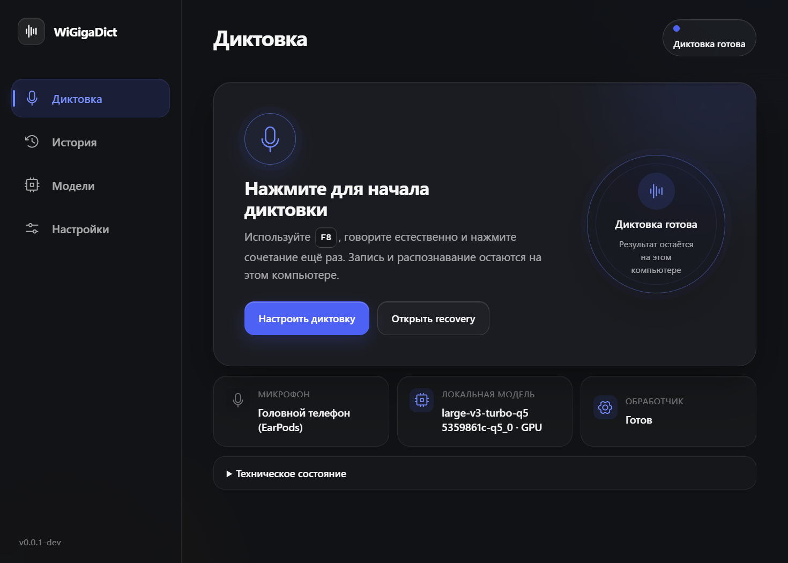
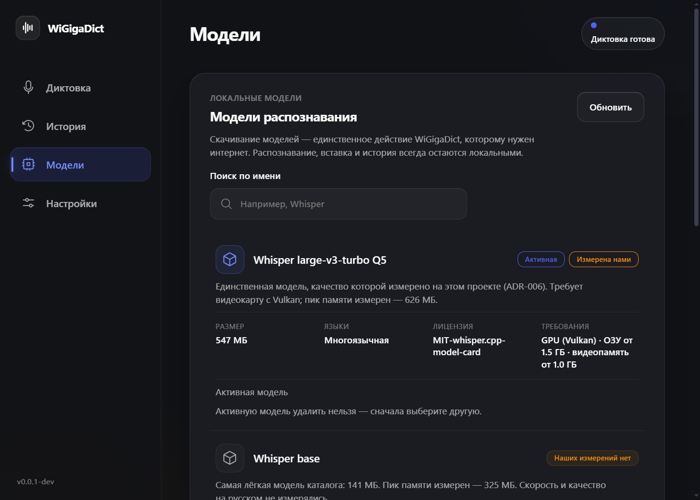
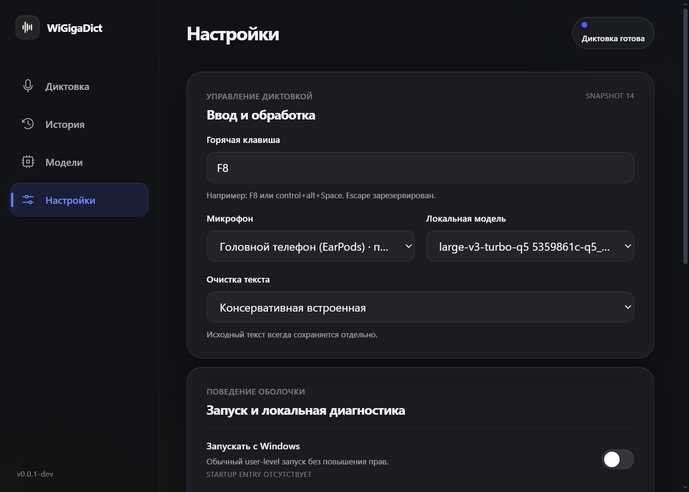

# WiGigaDict

Локальная диктовка для Windows: удерживаете горячую клавишу, говорите и отпускаете — распознанный текст появляется в активном приложении. Аудио и распознавание остаются на компьютере: без аккаунта, подписки, телеметрии и облачного fallback.

> English: WiGigaDict is a local-first push-to-talk dictation app for Windows. Speech recognition runs locally; no account, subscription, telemetry, or cloud fallback is required.



## Что уже работает

- push-to-talk по глобальной клавише `F8` (можно изменить);
- локальное распознавание Whisper на CPU или Vulkan GPU;
- вставка текста в активное окно с проверкой доставки;
- история и recovery для неподтверждённых вставок;
- автоматическое сохранение каждого аудиофайла `.wav` и готовой расшифровки `.txt` в локальную папку;
- выбор другой папки архива в **Настройки → Локальный архив** с переносом доступной истории;
- локальные модели с проверкой SHA-256 и подписи каталога;
- диагностика без содержимого диктовок.

Главная гарантия: **аудио не теряется молча**. Если приложение не смогло подтвердить вставку, результат остаётся в истории и не вставляется повторно без решения пользователя.

## Быстрый старт

1. Откройте [GitHub Releases](https://github.com/nakarandashe27/WiGigaDict/releases).
2. Скачайте `WiGigaDict_<версия>_x64-setup.exe` и `SHA256SUMS.txt`.
3. Проверьте SHA-256 по инструкции в [docs/INSTALL.md](docs/INSTALL.md).
4. Запустите установщик. Администраторские права не требуются.
5. Откройте **Модели**, установите подходящую модель и выберите её.
6. Поставьте курсор в любое поле ввода, удерживайте `F8`, говорите и отпустите клавишу.

Установщик пока не подписан сертификатом Authenticode, поэтому Windows SmartScreen может показать предупреждение «Неизвестный издатель». Хэш позволяет проверить целостность загрузки, но не заменяет подпись издателя. Не отключайте SmartScreen глобально.

## Варианты скачивания и установки

| Вариант                          | Для кого                          | Где инструкция                                                            |
| -------------------------------- | --------------------------------- | ------------------------------------------------------------------------- |
| NSIS `.exe` из Releases          | обычная установка                 | [docs/INSTALL.md](docs/INSTALL.md#1-обычная-установка-из-github-releases) |
| Проверяемый PowerShell installer | терминал, автоматизация, AI-агент | [docs/INSTALL.md](docs/INSTALL.md#2-установка-через-powershell)           |
| ZIP/TAR исходников релиза        | аудит и воспроизводимая сборка    | [docs/INSTALL.md](docs/INSTALL.md#3-сборка-из-архива-исходников)          |
| `git clone`                      | разработка и ручная сборка        | [docs/INSTALL.md](docs/INSTALL.md#4-сборка-из-git)                        |

Один «portable EXE» сейчас не публикуется: desktop зависит от двух локальных sidecar-бинарников и подписанного каталога моделей. Копирование только `wigigadict-desktop.exe` даст неполную установку.

Если установку выполняет Claude, Codex, Grok или другой coding-agent, передайте ему [docs/AGENT_INSTALL.md](docs/AGENT_INSTALL.md) либо готовый prompt из этого документа. Инструкции не зависят от бренда агента.

## Локальные данные и приватность

По умолчанию пользовательский архив создаётся в `%USERPROFILE%\Documents\WiGigaDict`. Каждая запись получает пару файлов с одинаковым идентификатором:

- `.wav` — исходное аудио;
- `.txt` — расшифровка после распознавания.

Папку можно изменить в **Настройки → Локальный архив → Выбрать папку**. Разрешены только абсолютные локальные пути; сетевые и device-path адреса намеренно отклоняются. При смене каталога приложение копирует туда доступную историю, а внутреннее защищённое хранилище продолжает обеспечивать recovery.

Служебная база, модели и внутреннее хранилище находятся в `%LOCALAPPDATA%\WiGigaDict`. Удаление приложения не должно автоматически удалять пользовательские записи и модели. Полная очистка выполняется пользователем отдельно после проверки нужных файлов.

## Модели

| Модель                    | Размер | Устройство | Статус измерений                                    |
| ------------------------- | -----: | ---------- | --------------------------------------------------- |
| Whisper base              | 141 МБ | CPU        | измерен пик памяти; качество не измерялось          |
| Whisper small             | 488 МБ | CPU        | требования оценочные                                |
| Whisper medium Q5         | 515 МБ | CPU        | измерен пик памяти 1075 МБ                          |
| Whisper large-v3-turbo Q5 | 548 МБ | Vulkan GPU | единственная модель с измерением качества в проекте |

Модели скачиваются с указанного upstream-источника и проверяются по SHA-256. Их лицензии отличаются от лицензии приложения и показываются до установки.





## Сборка и разработка

Требования:

- Windows 10 22H2 x64 или Windows 11 x64;
- Rust `1.97.1-x86_64-pc-windows-msvc` из `rust-toolchain.toml`;
- Visual Studio Build Tools 2022: MSVC v143 и Windows 11 SDK 22621;
- Node.js `24.16.0`, npm `11.9.0`;
- Vulkan SDK `1.4.357.0` для сборки GPU worker (скрипт проверяет размер и SHA-256).

```powershell
git clone https://github.com/nakarandashe27/WiGigaDict.git
Set-Location .\WiGigaDict
pwsh -NoProfile -File .\scripts\dev.ps1
```

Release-сборка и NSIS installer:

```powershell
pwsh -NoProfile -File .\scripts\build.ps1
```

Результат: `target\release\bundle\nsis\WiGigaDict_<версия>_x64-setup.exe`.

## Проверки качества

```powershell
cargo install cargo-deny --version 0.20.2 --locked
cargo install cargo-cyclonedx --version 0.5.9 --locked
pwsh -NoProfile -File .\scripts\quality.ps1
```

Gate включает Rust format/clippy/tests, frontend format/lint/typecheck/tests/build, frozen golden-flow thresholds и offline-аудит. `scripts/supply-chain.ps1` формирует dependency и SBOM-отчёты.

## Статус и ограничения

Проект находится в статусе **personal alpha**. End-to-end сценарий работает, но перед стабильным `1.0` остаются clean-install матрица на свежих Windows 10/11, серия из 100 диктовок golden-flow и подпись установщика. Облако, аккаунты, телеметрия и автообновление намеренно отсутствуют.

Архитектурный контекст и честный статус работ:

- [карта системы](context/architecture/01-обзор/карта-системы.md);
- [нерушимые правила данных](context/architecture/03-данные/правила-нерушимые.md);
- [журнал решений](context/architecture/06-решения/журнал-решений/);
- [дорожная карта](context/architecture/08-дорожная-карта/roadmap.md).

## Правила использования и лицензия

Код распространяется по лицензии [MIT](LICENSE): его можно использовать, изменять и распространять при сохранении текста лицензии и copyright notice. Программа предоставляется без гарантий. Пользователь отвечает за соблюдение законодательства и получение согласия собеседников при записи речи. Не используйте приложение для скрытой или запрещённой законом записи.

Модели речи и загружаемые данные распространяются их владельцами на собственных условиях и не перелицензируются этим репозиторием.
