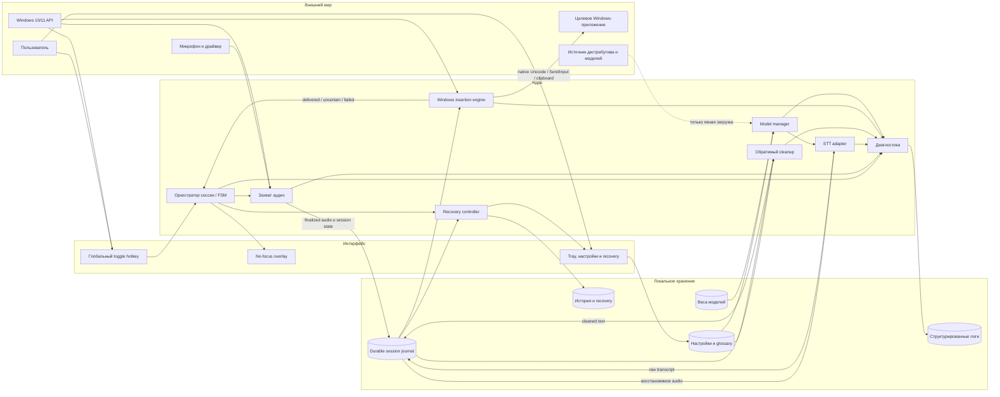

# Карта системы WiGigaDict

## Статус компонентов

M0 shell/workspace/empty sidecar baseline уже ✅ реализован; функциональные компоненты Dictation и M2 Notetaker остаются 🔜 запланированными. [Scope personal MVP](../../idea/04-mvp/scope.md) определяет обязательное подмножество, а Notetaker начинается только после personal alpha.

## Система целиком

## Компоненты

- **Глобальный toggle hotkey** — фиксирует отдельные физические key-down/key-up, игнорирует auto-repeat, проверяет конфликт shortcut и передаёт намерение пользователя оркестратору.
- **No-focus overlay** — немедленно показывает recording, processing, delivery и recovery, не перехватывая target window.
- **Tray, настройки и recovery** — единственная полноценная визуальная поверхность для выбора микрофона/модели, просмотра локальной истории и разрешения неопределённых результатов.
- **Оркестратор сессии / FSM** — владеет переходами `Idle → Armed → Recording → Finalizing → Transcribing → Cleaning → Inserting → Done/Recovery`, тайм-аутами и идемпотентностью.
- **Захват аудио** — читает только выбранный микрофон во время пользовательского триггера и формирует локальный аудиоартефакт.
- **STT adapter** — единая граница для первого выбранного runtime и последующего Whisper/GigaAM backend.
- **Обратимый cleanup** — deterministic glossary, пунктуация и meaning-preserving очистка; raw transcript не перезаписывается.
- **Windows insertion engine** — захватывает target identity при key-down и использует утверждённую лестницу вставки без автоматического `Enter`.
- **Recovery controller** — гарантирует, что неопределённый или недоставленный результат доступен для retry/copy/resolve.
- **Model manager** — различает наличие весов и готовность runtime, отвечает за explicit download, checksum, atomic install, warm-up и видимый fallback.
- **Диагностика** — ✅ пишет allowlisted content-free NDJSON trace со строгой схемой/rolling retention и создаёт локальный manifest-previewed bundle только после явного подтверждения владельца.
- **Session journal** — долговечная запись исхода каждой завершённой диктовки до cleanup и вставки; согласует SQLite/PCM через [commit-протокол двух хранилищ](../03-данные/правила-нерушимые.md#commit-протокол-sqlite--pcm) и закрывает blocker [R-01](../../idea/07-risks/operational.md#r-01--результат-теряется-при-сбое).

## Основной поток

1. Пользователь нажимает hotkey; система сохраняет identity текущего не-elevated target и сразу показывает overlay.
2. Оркестратор запускает запись первым нажатием и контролирует второе toggle-нажатие, cancel и watchdog.
3. После второго toggle-нажатия finalized audio и session marker проходят ordered durable commit + reconciliation между файловой системой и SQLite до вызова STT adapter; raw transcript записывается отдельным следующим состоянием.
4. Cleanup создаёт отдельную cleaned-версию, не изменяя raw.
5. Insertion engine проверяет target и пытается доставить cleaned text.
6. При подтверждённой доставке история получает статус `delivered`; при любой неопределённости — `uncertain` и действие recovery.
7. Диагностика фиксирует технический путь и timing независимо от пользовательского содержимого.

## M2: отдельный поток Notetaker

```mermaid
flowchart LR
    USER[Пользователь] -->|явно выбирает| LOCAL[Локальный media file]
    USER -->|явно включает capability и запускает| YD[Public Yandex Disk ingress]
    YD -->|network stage: .part → final| SOURCE[Accepted source]
    LOCAL -->|без сети; без копирования| SOURCE
    SOURCE --> PROBE[ffprobe + preflight/reservation]
    PROBE --> DECODE[Bundled LGPL ffmpeg decode]
    DECODE --> PCM[(Durable PCM chunks)]
    PCM --> NASR[NotetakerJob + shared ASR adapter]
    NASR --> RAW[(Immutable raw segments)]
    RAW --> STITCH[Versioned stitching]
    STITCH --> DOC[(Completed/incomplete transcript)]
    DOC --> VIEW[Notetaker view/search/copy]
    DOC --> EXPORT[Explicit TXT/SRT/VTT export]
```

- **Notetaker screen** — отдельная main-window поверхность с переключателем `Dictation / Notetaker`, drag-and-drop, file picker, link field, stage progress, pause/cancel и result; технические детали находятся под «Подробнее».
- **Notetaker orchestrator** — владеет `NotetakerJob`, queue/status/stage, source identity, durable chunks, pause/resume и cleanup. Он не использует Dictation FSM.
- **Media ingress** — локальный путь полностью offline; Yandex path — отдельная выключенная по умолчанию capability с видимой network stage.
- **Media decoder** — exact-pinned bundled LGPL FFmpeg CLI только в M2; исходный local file не изменяется, downloaded container удаляется после durable PCM.
- **Shared ASR adapter** — принимает canonical artifact и возвращает timestamped segments; Dictation имеет абсолютный runtime priority.
- **Transcript document** — immutable raw/stitched versions до явного удаления, без insertion entity. Editing/diarization/summary не входят в v1.

Поток и причины разделения зафиксированы в [ADR-001](../06-решения/журнал-решений/2026-08-21-001-notetaker-как-отдельный-режим.md).

## UX-стиль

WiGigaDict — **визуальный ambient-инструмент**, а не безголовый backend и не отдельный редактор:

- основную часть времени живёт в tray и не занимает рабочее пространство;
- на key-down мгновенно показывает компактный no-focus overlay — одно постоянное окно без native frame, одного инвариантного размера на все фазы;
- визуально различает запись, обработку, успех, неопределённость и ошибку;
- полное окно открывается для настройки, модели, истории, recovery, диагностики и будущего отдельного экрана Notetaker;
- звуки не являются обязательным каналом: важное состояние всегда понятно визуально.

UX следует [золотой сцене](../../idea/04-mvp/one-killer-feature.md) и [принципу проактивности безопасности](../../idea/06-principles/proactive.md).

### Статус реализации M1 / Step 14

- No-focus overlay реализован отдельным render-only окном 420×88: нативные Win32 styles запрещают activation/taskbar presence, позиция рассчитывается по work area foreground monitor, а terminal evidence-state скрывается автоматически.
- Основное окно собрано как компактная локальная signal-console с разделами «Диктовка», «История» и «Настройки»; tray открывает нужный раздел только по явному действию пользователя.
- Цвет, текст и геометрия различают запись, обработку, подтверждённую доставку, неопределённость и ошибку. Transcript/audio никогда не входят в overlay event.
- Recovery/settings диалоги поддерживают keyboard-only путь, visible focus, Escape, focus trap и reduced motion; failure copy всегда сообщает сохранность и одно следующее действие.

### Статус реализации M1 / Step 15

- Diagnostic service принадлежит privileged Rust shell и хранит trace только внутри managed `logs/diagnostics`; main WebView получает строго content-free status/preview/receipt, overlay не получает diagnostic commands.
- Capture, ASR, target check, delivery и storage failure записываются как bounded typed events с process generation/correlation/sequence. Expanded progress остаётся opt-in, essential lifecycle/error events не отключаются.
- Локальный bundle повторно валидирует trace, фиксирует source hashes/counts и exclusion manifest, требует абсолютный новый destination и exact confirmation; создания сети или шага отправки в этой способности нет.
- Offline deny-all, malformed/future-schema, marker redaction, retention/restart, crash-tail и recovery/focus/commit ordering проверяются автоматически в общем quality gate.

## Контракты компонентов

- Ядро: [характер](../02-ядро/характер.md), [права](../02-ядро/права-доступа.md), способности [записи](../02-ядро/способности/записать-диктовку.md), [ASR](../02-ядро/способности/распознать-речь.md), [вставки](../02-ядро/способности/вставить-текст.md) и [recovery](../02-ядро/способности/восстановить-результат.md).
- M2 Notetaker: [import](../02-ядро/способности/импортировать-запись.md), [long-form transcription](../02-ядро/способности/транскрибировать-запись.md) и [export](../02-ядро/способности/экспортировать-транскрипт.md).
- Данные: [сущности](../03-данные/сущности.md), [ER-схема](../03-данные/схема-связей.md) и [нерушимые правила](../03-данные/правила-нерушимые.md).
- Потоки: [триггеры, фоновые задачи и failure paths](../04-потоки/триггеры.md).
