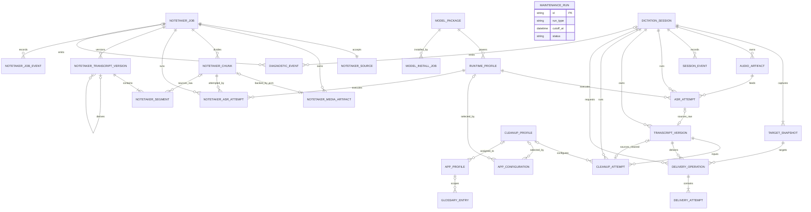

# Схема связей

## ER-диаграмма

## Кардинальности и смысл

- `DictationSession 1:N TargetSnapshot` — один initial snapshot обязателен, новые появляются только при явном Retry.
- `DictationSession 1:N AudioArtifact` — обычно один finalized artifact; дополнительные допустимы для recoverable fragments, но каждый принадлежит одной session.
- `DictationSession 1:N SessionEvent` — журнал append-only и полностью упорядочен внутри session.
- `DictationSession 1:N AsrAttempt` — retry создаёт новую attempt, старую не перезаписывает.
- `AsrAttempt 1:0..1 TranscriptVersion` и `CleanupAttempt 1:0..1 TranscriptVersion` — source optional на уровне общей таблицы, но XOR-инвариант `kind` требует ровно один правильный source FK.
- `DeliveryOperation 1:N DeliveryAttempt` — operation содержит лестницу методов; явный retry создаёт новую operation.
- `ModelPackage 1:N RuntimeProfile` — одни веса могут иметь CPU/GPU/adapter profiles.
- `AppConfiguration` ссылается максимум на один active runtime и cleanup profile; исторические attempts сохраняют собственные FK/snapshot версии.
- `GlossaryEntry N:0..1 AppProfile` — global/mode scope не требует app FK; app scope требует его.
- `DiagnosticEvent N:0..1 DictationSession` — startup/model/install events могут быть app-wide.
- `MaintenanceRun` намеренно не имеет доменного FK: это content-free ledger периодической локальной операции.
- `NotetakerJob` не имеет FK на `DictationSession`: это два разных aggregate и FSM. Они совместно ссылаются только на `RuntimeProfile` и content-free diagnostics.
- `NotetakerJob 1:1 NotetakerSource` фиксирует один local/Yandex source; другой контент создаёт новый job.
- Каждый decoded `NotetakerChunk` имеет ровно один `kind=pcm_chunk` artifact; до decode обе стороны optional, а downloaded-container/retained-PCM artifacts не притворяются chunk. Retry создаёт новую attempt, но не второй logical chunk.
- `NotetakerTranscriptVersion 1:N NotetakerSegment` хранит immutable raw/stitched intervals; derived version ссылается на source version, не перезаписывает её.

Все межсущностные связи используют id/FK. `process_identity`, `model_name`, `spoken_form` и другие значения никогда не заменяют FK там, где существует сущность-владелец.

Описание полей: [сущности.md](сущности.md). Ограничения связей: [правила-нерушимые.md](правила-нерушимые.md).
